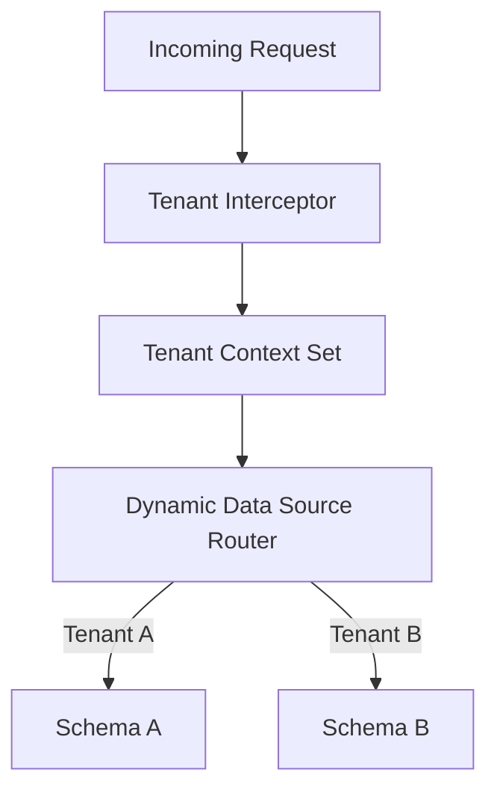
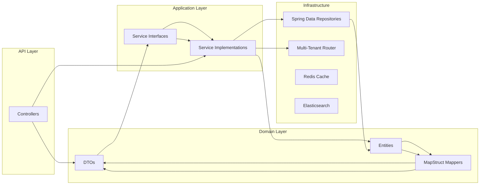

# 🏢 TenancyLink – Scalable Multi-Tenant Project Management Backend

**TenancyLink** is an enterprise-grade backend platform designed for **multi-tenant SaaS environments**, offering complete data isolation, dynamic schema support, and audit-compliant orchestration. Built with **Spring Boot**, **modular monolith architecture**, and **clean code principles**, it powers secure, scalable, and customizable project management for diverse organizations.

---

## 🧱 Project Structure

```
src/main/java/com/multi/tenant_SaaS_Project_Management_System/
├── TenantSaaSProjectManagementSystemApplication.java ← Spring Boot entry point
├── configs/                      ← Multi-tenant & security configurations
├── controllers/                 ← REST APIs for project/task/user modules
├── dto/                          ← Request/response models
├── entity/                       ← JPA entities mapped to tenant schemas
├── enums/                        ← Domain enums (status, priority, roles)
├── exception/                    ← Custom exceptions & global handlers
├── mapper/                       ← MapStruct DTO ↔ Entity converters
├── repository/                   ← Spring Data repositories
├── repository_services/         ← Repository implementations
├── service/                      ← Business logic orchestration
├── service_impl/                ← Core service implementations
├── util/                         ← Utility classes & validators
└── resources/
    ├── application.yml           ← Spring configuration
    └── swagger.yaml              ← OpenAPI spec
```

> 🧼 Follows **Clean Architecture** with layered separation of concerns — making it testable, maintainable, and extensible.

---

## 🔐 Multi-Tenant Strategy



- **Database Per Tenant**: Dedicated schema for each tenant  
- **Tenant Context**: Thread-local tenant identification  
- **Dynamic Routing**: Runtime data source switching  
- **Zero Leakage**: Complete data isolation  

---

## 🧩 Core Features

| Module               | Capabilities                                                                 |
|----------------------|------------------------------------------------------------------------------|
| **Project Management** | Full lifecycle: create, assign, track, archive                              |
| **Task Management**    | Custom workflows, statuses, priorities, deadlines                           |
| **User Management**    | Role-based access control (RBAC), tenant-specific users                     |
| **Custom Fields**      | Dynamic schema per tenant for flexible data modeling                        |
| **Real-Time Analytics**| Dashboards for project/task metrics via WebSocket or polling                |
| **Audit Trail**        | Activity logging for compliance and traceability                            |

---

## ⚙️ Technical Highlights

- 🔐 **JWT Authentication** — Secure token-based access  
- 📡 **RESTful APIs** — Full CRUD with pagination & filtering  
- 💾 **Redis Caching** — Performance boost for hot-path data  
- 📁 **File Management** — Secure upload & attachment system  
- 🔍 **Elasticsearch** — Full-text search across tenants  
- 📑 **Swagger/OpenAPI** — Interactive API documentation  

---

## 🏗️ Architecture Overview



---

## 🧠 Design Patterns Implemented

- 🧩 **Strategy Pattern** — Tenant configuration strategies  
- 🏭 **Factory Pattern** — Tenant-specific service instantiation  
- 📚 **Repository Pattern** — Data access abstraction  
- 🔔 **Observer Pattern** — Event-driven notifications  
- 💾 **Command Pattern** — Audit logging commands  
- 🔎 **Specification Pattern** — Dynamic query builders  

---

## 🐳 Docker Integration (Coming Soon)

Dockerization is planned to enable:

- 🚀 Containerized deployment  
- 🔄 Environment parity across dev/stage/prod  
- ⚙️ Simplified contributor onboarding  

### Sample Dockerfile

```Dockerfile
FROM eclipse-temurin:17-jdk-alpine
WORKDIR /app
COPY target/tenant-saas.jar tenant-saas.jar
ENTRYPOINT ["java","-jar","tenant-saas.jar"]
```

### Sample docker-compose.yml

```yaml
version: '3.8'
services:
  app:
    build: .
    ports:
      - "8080:8080"
    environment:
      - SPRING_PROFILES_ACTIVE=prod
  db:
    image: postgres:13-alpine
    environment:
      POSTGRES_DB: tenant_db
      POSTGRES_USER: admin
      POSTGRES_PASSWORD: secret
    volumes:
      - db_data:/var/lib/postgresql/data
  redis:
    image: redis:alpine
  elasticsearch:
    image: docker.elastic.co/elasticsearch/elasticsearch:7.17.0
    environment:
      - discovery.type=single-node

volumes:
  db_data:
```

---

## ⚡ Quick Start

```bash
# Clone the repo
git clone https://github.com/Shubh00796/Multi-tenant-SaaS-Project-Management-System-.git
cd Multi-tenant-SaaS-Project-Management-System-

# Build & run
mvn clean install
java -jar target/tenant-saas.jar

# Visit Swagger UI
open http://localhost:8080/swagger-ui.html
```

---

## 📚 References

- 📘 [Spring Boot Documentation](https://docs.spring.io/spring-boot/docs/current/reference/html/)
- 📘 [MapStruct – Java Bean Mapping](https://mapstruct.org/)
- 📘 [Multi-Tenant Architecture – Azure Guide](https://learn.microsoft.com/en-us/azure/architecture/guide/saas-multitenant-solution-architecture/)
- 📘 [Clean Architecture – Uncle Bob](https://8thlight.com/blog/uncle-bob/2012/08/13/the-clean-architecture.html)

---

## 🤝 Contributing

We welcome your ideas and PRs! 🚀

```bash
# Fork + branch
git checkout -b feature/my-feature

# Commit & push changes
git commit -m "Add feature"
git push origin feature/my-feature

# Open a pull request
```

For major changes, open an issue first to discuss your proposal.

---

## 🙌 Support & Feedback

If this project helped you:  
⭐ Star the repo  
🐛 Report issues  
💬 Share your feedback!

---

## 🏆 Why This Project Stands Out

This isn’t just a backend — it’s a **multi-tenant orchestration engine** built for real-world SaaS platforms. With dynamic schema support, audit logging, and tenant-level analytics, **TenancyFlow** is engineered to scale, secure, and succeed across industries.

---
